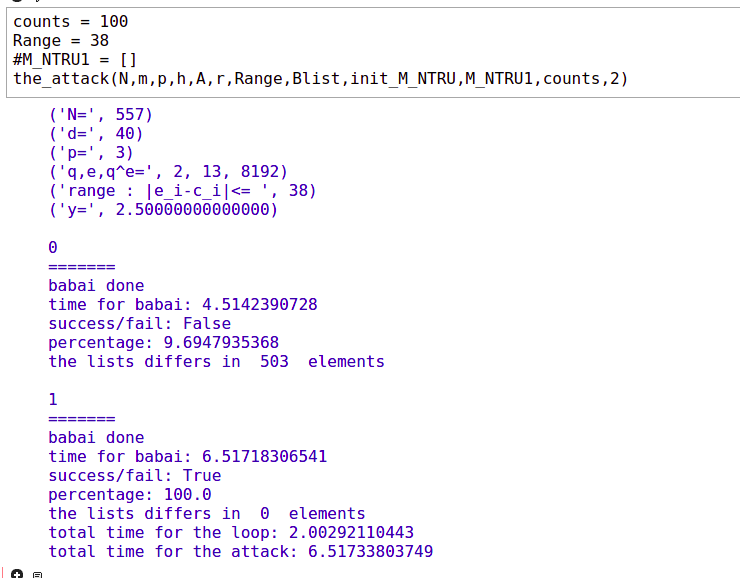

The pseudocode of the attack is the following.


We use fpylll (https://github.com/fplll/fpylll) in order to apply Babai's nearest plane algorithm. 
So we shall ```import fpylll``` in sagemath. Babai's algorithm is a method of ```GSO``` in fpylll library.

For N=557,q=8192 we got the message with babai as a cvp oracle.



In the previous experiment we set ```count=100```, i.e. we pick 100 different vectors **E**, all having the propery
**||E_i-c_i ||<=38**. In the second try, we found the message.

See attack.py
